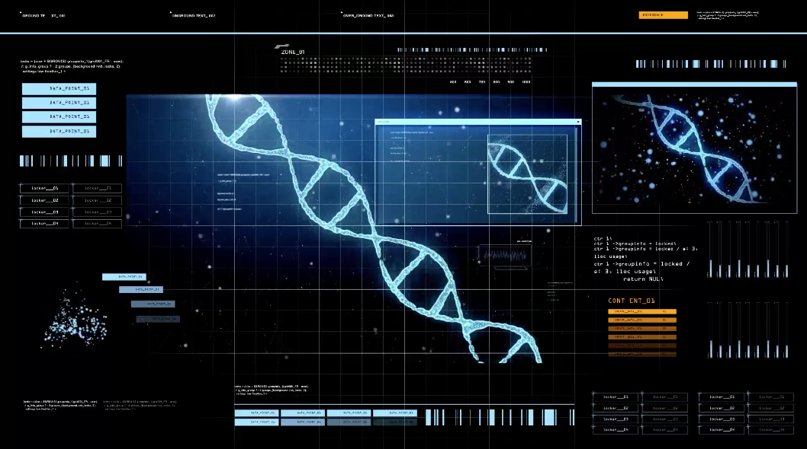

# DTU Synbio Lab Automation



Automation protocols, robot guides, and reusable unit operations for synthetic biology workflows at DTU.

This repository is the working home for lab automation code that is clear enough for scientists to review, structured enough for developers to maintain, and explicit enough for reliable robot execution.

## At a Glance

| Area | What belongs here |
| --- | --- |
| `protocols/opentrons/` | Robot-ready Opentrons protocols. |
| `unit_operations/` | Reusable liquid-handling and workflow building blocks. |
| `workflows/` | Workflow descriptions mapped to DBTL stages. |
| `guides/robots/` | Robot setup, calibration, run, and troubleshooting guides. |
| `guides/workflows/` | Literate programming, workflow authoring, and experiment planning guides. |
| `llm_guidelines/` | Guidance for using LLMs to write safer, simpler Opentrons protocols. |
| `labware/` | Custom or validated labware definitions. See the [Opentrons Labware Library](https://labware.opentrons.com/) for official definitions. |
| Opentrons API docs | Official API and robot documentation: <https://docs.opentrons.com/> |
| `data/raw/` | Original input data. |
| `data/interim/` | Intermediate working data. |
| `data/processed/` | Cleaned or analysis-ready data. |
| `data/external/` | Third-party reference data. |
| `notebooks/` | Analysis, planning, and workflow-development notebooks. |
| `src/` | Python helpers for data handling, protocol generation, validation, and analysis. |
| `docs/` | Longer documentation built with Sphinx or similar tooling. |
| `references/` | Figures, papers, diagrams, and supporting material. |

## LLM Guidelines

The [`llm_guidelines/`](llm_guidelines/opentrons_protocol_guidelines.md) guide is inspired by the Karpathy-style LLM coding guidelines collected in [andrej-karpathy-skills](https://github.com/multica-ai/andrej-karpathy-skills/tree/main), which focus on reducing common agent mistakes such as hidden assumptions, overcomplication, and unfocused edits. This repository adapts that idea for liquid handlers and new automation users: the aim is to help someone describe a workflow in a single prompt and still get protocol code that asks the right questions, uses runtime parameters, respects deck reality, and can be simulated before touching samples.

## Quickstart

Install:

- Git: <https://git-scm.com/install>
- VS Code: <https://code.visualstudio.com/download>

Clone:

```bash
git clone https://github.com/DALSA-Lab/dtu_synbio_lab_automation.git
cd dtu_synbio_lab_automation
```

Set up Python dependencies with `uv`:

```bash
uv sync
uv run python test_environment.py
```

Simulate every Opentrons protocol before robot use:

```bash
uv run opentrons_simulate protocols/opentrons/<protocol>.py
```

## Workflow Abstraction

The repository follows the hierarchy described in:

> **Abstraction hierarchy to define biofoundry workflows and operations for interoperable synthetic biology research and applications**  
> Nature Communications 16, Article 6056 (2025)  
> <https://www.nature.com/articles/s41467-025-61263-6>

| Level | Name | In this repo |
| --- | --- | --- |
| 0 | Project | Scientific objective or campaign. |
| 1 | Service/Capability | Automation capability offered by the lab. |
| 2 | Workflow | Goal-oriented experimental procedure. |
| 3 | Unit Operation | Executable robot or software action. |

Opentrons protocols should be documented at the **workflow level** and implemented as clear, reusable **unit operations**. Workflows should be mapped to the Design-Build-Test-Learn cycle when relevant.

## Capabilities

| Capability | Examples |
| --- | --- |
| Liquid handling | Transfers, aliquoting, normalization, reagent distribution. |
| Plate setup | Plate maps, controls, standards, randomized layouts. |
| Serial dilution | Gradients, calibration curves, assay preparation. |
| Culture handling | Media addition, inoculation, induction, sampling. |
| DNA assembly setup | Golden Gate or Gibson-style reaction setup. |
| Assay preparation | Reporter assays, growth assays, enzyme assays. |
| Instrument handoff | Thermocycler, incubator, shaker, plate reader, centrifuge. |
| Data workflows | Plate map joins, QC, run metadata, downstream exports. |

## Protocol Library Examples

Curated examples from the [Opentrons Protocol Library](https://library.opentrons.com/) live in `protocols/opentrons/library_examples/`. These are reference protocols, not yet in-house validated DTU protocols.

| Protocol | Robot | Stage | Why it is useful |
| --- | --- | --- | --- |
| [E. coli Transformation and Recovery](protocols/opentrons/library_examples/ecoli-transformation-recovery/README.md) | OT-2 | Build | Transformation workflow with clear manual pauses and temperature control. |
| [Colony PCR Preparation](protocols/opentrons/library_examples/colony-pcr-prep/README.md) | OT-2 | Test | Readable PCR setup example for screening transformed colonies. |
| [Customizable Serial Dilution for OT-2](protocols/opentrons/library_examples/customizable_serial_dilution_ot2/README.md) | OT-2 | Test | Foundational dilution workflow for assays, standard curves, and titrations. |
| [Automated Agar Plate Method for Viable Bacteria Assessment](protocols/opentrons/library_examples/agar_plate_method_bacteria/README.md) | Flex | Test | Viable-count workflow combining dilution, spotting, and incubation handoff. |

## Workflows and Unit Operations

Suggested workflow ID:

```text
W-<DBTL>-<number>-<short-name>
```

Example workflows:

| Workflow ID | Name | Stage |
| --- | --- | --- |
| `W-BUILD-001-dna-assembly-setup` | DNA assembly reaction setup | Build |
| `W-BUILD-002-culture-inoculation` | Culture inoculation | Build |
| `W-TEST-001-serial-dilution` | Serial dilution | Test |
| `W-TEST-002-assay-plate-setup` | Assay plate setup | Test |
| `W-LEARN-001-plate-data-qc` | Plate data quality control | Learn |

Core unit operations:

`load_labware`, `transfer`, `distribute`, `consolidate`, `mix`, `serial_dilution`, `normalize`, `pause_handoff`, `incubate`, `export_metadata`

## Clean code (for Opentrons and beyond):

Clean code is code that makes intent obvious. In a liquid handler protocol, that means a scientist can understand the experiment and an automation developer can understand the robot behavior.

Borrowing from the core principles of *Clean Code: A Handbook of Agile Software Craftsmanship* by Robert C. Martin, Opentrons protocols should favor meaningful names, small units of responsibility, clear boundaries, minimal surprise, and fast feedback. In practice:

- Use meaningful names: prefer `overnight_cultures`, `dilution_plate`, and `induction_media` over `plate1`, `plate2`, or `reagent`.
- Make each section do one thing: metadata, runtime parameters, deck setup, validation, and execution should be easy to find.
- Keep functions honest: a helper like `calculate_dilution_volumes()` is useful. A one-line wrapper around `pipette.transfer()` usually just hides the protocol.
- Prefer CSV data plus loops for repeated robot actions: plate maps, transfer tables, and sample lists are easier to review as structured files than copy-pasted commands.
- Avoid magic numbers: operator choices should be runtime parameters. True invariants should have clear names.
- Fail early: validate sample count, wells, volumes, labware, and pipette capacity before liquid moves.
- Let comments explain intent or risk, not obvious Python.
- Keep side effects visible: tip changes, mixing, pauses, delays, module temperatures, and manual handoffs should be deliberate.
- Simulate before running on real samples.

Use [Opentrons runtime parameters](https://docs.opentrons.com/python-api/runtime-parameters/) for values the operator should choose during run setup: sample count, transfer volume, dilution factor, mix repetitions, protocol mode, or a CSV plate map. Use constants only for values that are not choices for a normal run, such as fixed deck slots, labware load names, API level, or validated lab-specific safety limits.

For small protocols, start with the basics: parameters, deck setup, and a simple loop.

Basic version:

```python
# Import the Opentrons Protocol API.
# This gives us the objects used to describe labware, pipettes, and robot actions.
from opentrons import protocol_api

# Metadata is shown in the Opentrons App.
# Keep it short and focused on the biological workflow.
metadata = {
    "protocolName": "Example serial dilution setup",
    "author": "DTU Synbio Lab Automation",
    "description": "Prepare a simple dilution plate from overnight cultures.",
}

# Requirements tell Opentrons which robot and API version the protocol expects.
requirements = {"robotType": "OT-2", "apiLevel": "2.20"}


def add_parameters(parameters: protocol_api.ParameterContext) -> None:
    # Runtime parameters change how the script works during run setup.
    # Use them for values the operator should choose in the Opentrons App.
    parameters.add_int(
        variable_name="sample_count",
        display_name="Sample count",
        description="Number of samples to transfer.",
        default=3,
        minimum=1,
        maximum=12,
    )
    parameters.add_float(
        variable_name="transfer_volume_ul",
        display_name="Transfer volume",
        description="Volume moved from each sample.",
        default=50,
        minimum=5,
        maximum=200,
        unit="uL",
    )


def run(protocol: protocol_api.ProtocolContext) -> None:
    # Load the physical deck layout.
    # A reader should be able to match this block to the robot deck.
    tiprack = protocol.load_labware("opentrons_96_tiprack_300ul", 1)
    source_plate = protocol.load_labware("nest_96_wellplate_200ul_flat", 2)
    dilution_plate = protocol.load_labware("nest_96_wellplate_200ul_flat", 3)
    pipette = protocol.load_instrument("p300_single_gen2", "right", tip_racks=[tiprack])

    # Turn the selected sample count into wells.
    # This keeps repeated work as data instead of copy-pasted transfers.
    source_wells = source_plate.wells()[: protocol.params.sample_count]
    destination_wells = dilution_plate.wells()[: protocol.params.sample_count]

    # Execute the liquid-handling plan.
    # A simple loop is clearer than many repeated transfer commands.
    for source, destination in zip(source_wells, destination_wells):
        pipette.transfer(
            protocol.params.transfer_volume_ul,
            source,
            destination,
            new_tip="always",
        )
```

Expanded version:

Add validation, run-log comments, and controlled mixing only when they make the protocol safer or easier to run.

```python
def add_parameters(parameters: protocol_api.ParameterContext) -> None:
    # Keep the same operator-facing parameters from the basic version.
    parameters.add_int(
        variable_name="sample_count",
        display_name="Sample count",
        description="Number of samples to transfer.",
        default=3,
        minimum=1,
        maximum=12,
    )
    parameters.add_float(
        variable_name="transfer_volume_ul",
        display_name="Transfer volume",
        description="Volume moved from each sample.",
        default=50,
        minimum=5,
        maximum=200,
        unit="uL",
    )
    parameters.add_int(
        variable_name="mix_repetitions",
        display_name="Mix repetitions",
        description="Number of mixes after each transfer.",
        default=3,
        minimum=0,
        maximum=10,
    )


def run(protocol: protocol_api.ProtocolContext) -> None:
    # Keep deck setup explicit and easy to compare with the robot deck.
    tiprack = protocol.load_labware("opentrons_96_tiprack_300ul", 1)
    source_plate = protocol.load_labware("nest_96_wellplate_200ul_flat", 2)
    dilution_plate = protocol.load_labware("nest_96_wellplate_200ul_flat", 3)
    pipette = protocol.load_instrument("p300_single_gen2", "right", tip_racks=[tiprack])

    # Validate risky assumptions before moving liquid.
    if protocol.params.transfer_volume_ul > pipette.max_volume:
        raise ValueError("Transfer volume exceeds pipette capacity.")

    # Build the transfer plan from runtime parameters.
    source_wells = source_plate.wells()[: protocol.params.sample_count]
    destination_wells = dilution_plate.wells()[: protocol.params.sample_count]

    for source, destination in zip(source_wells, destination_wells):
        # Comments appear in the run log.
        # Use them to make the biological step visible to the operator.
        protocol.comment(
            f"Transfer {protocol.params.transfer_volume_ul} uL from {source.well_name} "
            f"to {destination.well_name}."
        )

        # Mixing and tip use are part of the method.
        # Keep them explicit.
        pipette.transfer(
            protocol.params.transfer_volume_ul,
            source,
            destination,
            mix_after=(
                protocol.params.mix_repetitions,
                min(protocol.params.transfer_volume_ul, 120),
            ),
            new_tip="always",
        )
```

Use helper functions when the protocol becomes hard to scan, for example when parsing a CSV plate map, calculating serial dilutions, validating many runtime parameters, or sharing the same deck setup across multiple protocols. The goal is not "more functions". The goal is code where the workflow reads like the experiment it performs.

## Robot Guides

Robot-specific guides live in `guides/robots/` and should cover:

- Setup and startup checks.
- Calibration and labware positioning.
- Protocol upload and simulation.
- Run monitoring and cleanup.
- Known failures and troubleshooting.

Current guides:

- [Getting Started with Opentrons OT-2](guides/robots/00_How_to_start_with_Opentrons.ipynb)
- [Building your first Opentrons protocol](guides/robots/01_Building_your_first_protocol.ipynb)
- [Opentrons Flex guide](guides/robots/02_Opentrons_Flex_Guide.ipynb)
- [Plate reader guide](guides/robots/03_Plate_Reader_Guide.ipynb)
- [Thermocycler guide](guides/robots/04_Thermocycler_Guide.ipynb)

## Workflow Guides

Workflow guides live in `guides/workflows/` and describe how to design, document, and maintain reusable automation workflows.

Current guides:

- [How to write a literate programming protocol](guides/workflows/02_How_to_write_a_literate_programming_protocol.ipynb)
- [Workflow authoring guide](guides/workflows/03_Workflow_Authoring_Guide.ipynb)
- [Unit operation authoring guide](guides/workflows/04_Unit_Operation_Authoring_Guide.ipynb)
- [Experiment bootstrapping guide](guides/workflows/05_Experiment_Bootstrapping_Guide.ipynb)

## Repository Structure

```text
.
|-- README.md
|-- references/
|-- guides/
|   |-- robots/
|   `-- workflows/
|-- protocols/
|   |-- opentrons/
|   `-- shared/
|-- workflows/
|-- unit_operations/
|-- labware/
|-- data/
|   |-- raw/
|   |-- interim/
|   |-- processed/
|   `-- external/
|-- notebooks/
|-- src/
|-- docs/
|-- reports/
|-- tests/
`-- pyproject.toml
```

## Safety

Before running a protocol on real samples, confirm the deck layout, labware definitions, reagent identities, volumes, pipette compatibility, module settings, and simulation result. New or modified workflows should be reviewed by both an automation developer and a trained lab operator.

## References

Kim, H., Hillson, N.J., Cho, B.-K. et al. **Abstraction hierarchy to define biofoundry workflows and operations for interoperable synthetic biology research and applications.** *Nature Communications* 16, 6056 (2025). <https://doi.org/10.1038/s41467-025-61263-6>

Martin, R.C. **Clean Code: A Handbook of Agile Software Craftsmanship.** Prentice Hall, 2008.
